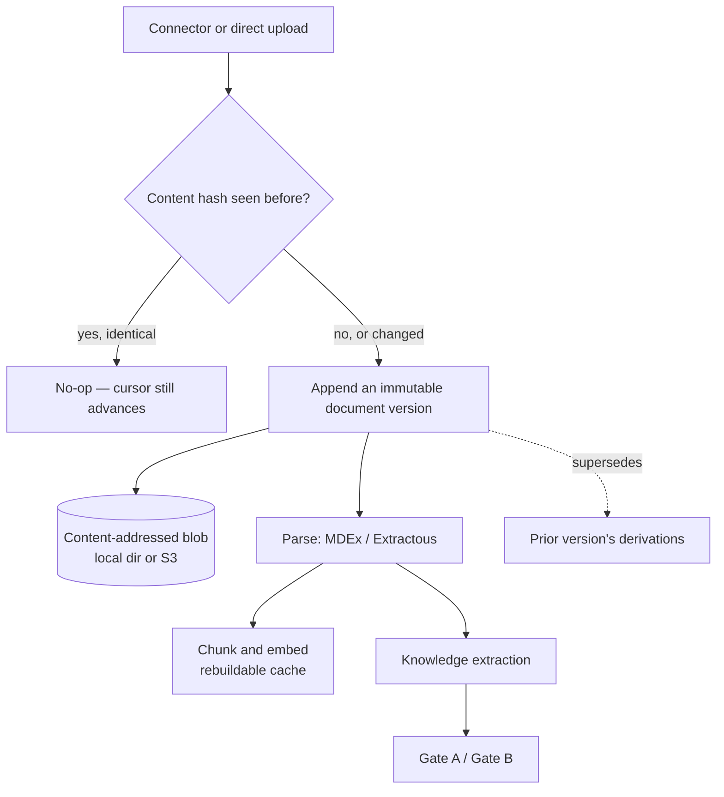
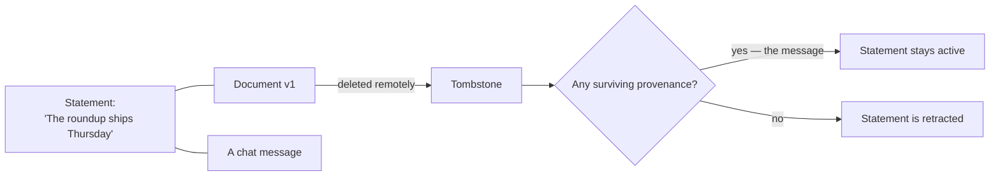

<!-- SPDX-License-Identifier: Cartulary-Sustainable-Use-1.0 -->

# Documents and connectors

A document is a second kind of raw observation. Like a message, it is recorded
first and interpreted second, and the knowledge extracted from it goes through
exactly the same pipeline and the same gates.

## Versions are immutable and hash-addressed

Changed content **appends** a new version and supersedes the stale derivations
of the previous one. It never rewrites history. Re-seeing identical content is
a no-op, identified by content hash.

Original bytes go to a content-addressed blob store — a local directory by
default, or any S3-compatible bucket by configuration. The blob adapter is a
runtime infrastructure choice and changes nothing about document semantics.

## Processing holds no database connection while it works

Fetching the bytes, parsing them, embedding the chunks, and extracting
knowledge all happen between two short database transactions rather than inside
one long one — the same shape the
[ingest pipeline](ingest-pipeline.md#the-model-call-holds-no-database-connection)
uses for messages, and for the same reason. Processing a large PDF can take
minutes across the blob store, the parser, and two model calls; a transaction
held open across all of it would outlast what the connection pool allows and
lose the writes at the end.

So one transaction reads the version and what surrounds it, the derivation runs
holding nothing, and a second transaction writes the chunks, the knowledge, the
supersession, and the version's processing status together. A version is marked
complete only when that second transaction commits, so an interrupted run is
retried rather than left half-applied.

## Supersession and deletion do not silently retract knowledge

When a document version is superseded, or a remote document is deleted, the old
version becomes a **tombstone** rather than disappearing. Knowledge derived
from it is retracted only if that document was its *last* remaining support.

A statement with independent corroboration keeps living. Only a statement whose
last supporting row disappears is retracted.

## Connector sync

Connectors submit raw document versions. They do not write knowledge, and they
do not get a shortcut past the gates.

The sync loop is built so that a crash mid-page cannot lose or duplicate work:

1. fetch a page from the remote source;
2. handle every document in it durably;
3. **only then** advance the cursor.

A crash before step 3 replays the page; the repeated content hashes make the
replay a no-op.

## Chunks and vectors are rebuildable

Document chunks and their embeddings are derived caches. They are excluded from
logical exports and rebuilt at the destination through ordinary ingest, which
is also why an import into a differently configured embedder is safe: vectors
are recomputed in the destination's vector space rather than reused.

| Included in a logical export | Excluded |
| --- | --- |
| Checksum-verified original blobs | Chunks |
| Durable document-version metadata | Embeddings |
| Governed knowledge and audit graph | Extracted-text caches |

See [Export and import](../operations/portability.md).

## Erasure

Erasure removes exclusive blobs and document-only knowledge, while preserving
content-safe audit evidence and any knowledge that has surviving provenance
from elsewhere.

## What never leaves the document boundary

Document bytes, extracted text, connector cursors, source metadata, and
connector secrets are never copied into audit metadata, telemetry, or job
arguments. Only ids, hashes, counts, and error classes cross that line.

## Current limitation

Connector administration has no user interface in this release; connectors are
configured and driven programmatically. See
[Limitations](../reference/limitations.md).
