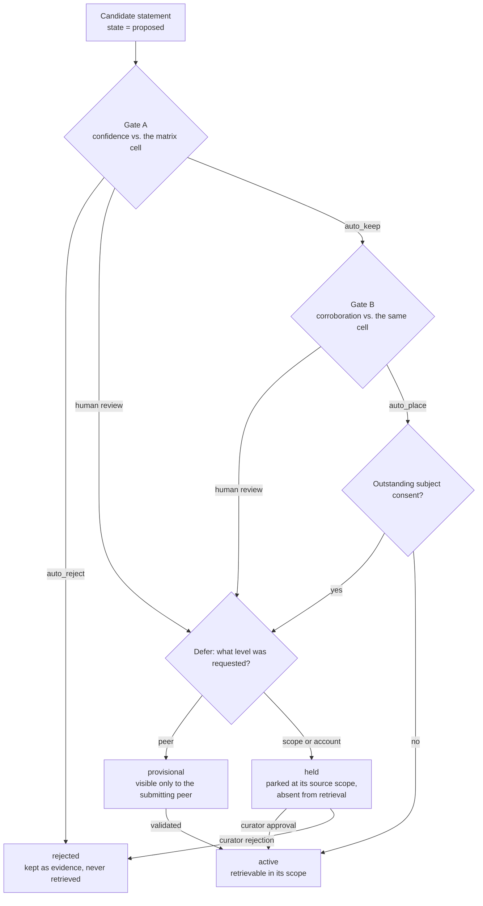
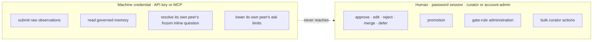

<!-- SPDX-License-Identifier: Cartulary-Sustainable-Use-1.0 -->

# Governance gates

Two gates sit between an observation and durable, visible memory. Gate A asks
*is this worth keeping at all?* Gate B asks *how widely may it be exposed?*
Both run in one pass over each proposal, and each can write its own decision
record.

## The matrix

A gate decision is a lookup in a matrix cell keyed by **target level** and
**sensitivity**. Lookup order is:

1. the active rule attached to the item's own scope;
2. the account-wide rule;
3. a built-in cell that demands human review at both gates.

A missing or misconfigured matrix therefore falls back to human judgment, never
to auto-activation.

Gate A modes are `auto_keep` (keep when confidence clears the cell's minimum),
`auto_reject` (drop unconditionally), and anything else meaning human review.
Gate B has `auto_place` (place when corroboration clears the cell's minimum)
and human review.

## Target levels and blast radius

Target levels widen in the order **peer → scope → account**. The level is what
the gates judge — how far the item is asking to travel. It is not itself a
retrieval filter; what a reader actually sees follows the item's scope and
lifecycle state.

Because the matrix is keyed by level, the same confidence value can
auto-activate a peer-level item and still queue a scope-level one for a human.

| Requested level | Default outcome without an explicit rule |
| --- | --- |
| Peer | `provisional` — visible only to the peer it came from |
| Scope | `held` — parked at its source scope, absent from retrieval |
| Account | `held` — same, with a higher bar to clear |

## Consent for personal knowledge

Personal knowledge about a human does not reach a wider scope on a curator's
say-so. Approving a scope-level review of a personal item without a granted,
verified consent record parks the queue entry in `awaiting_consent` and leaves
the knowledge exactly where it was.

Consent is:

- **granted by the subject**, not by an administrator;
- **specific to one target scope**, not blanket;
- **only counted when it arrived over a verified channel**.

A *denial* is accepted through any channel, because withdrawing exposure should
never be harder than granting it.

## Who may decide

Curator authority is not reachable over any machine-facing route. `decide` and
`bulk_decide` accept a browser-session human holding an account-admin or
curator role and refuse machine credentials. Each call takes a
transaction-scoped advisory lock on the queue entry, so two curators cannot
decide the same item concurrently.

**Curators never write knowledge text directly.** An edit mints a replacement
row through the pipeline-only create action, supersedes the original, and sends
the replacement back through the gates — so curator-authored text passes the
same checks as extracted text.

## Peer inline validation

A validation question can be attached to the result of a read tool an agent
already called, letting a peer confirm or correct a statement inside the
conversation they are already in rather than in a console they will never open.

The selector is deadline-bounded and fails open: if it cannot pick a question
in time, the read returns normally with no question attached. A machine
credential may resolve only *its own peer's* frozen question, and may lower
that peer's interruption limits — nothing else.

## Contest, redact, and erase

A person acting on knowledge about themselves has a separate, human-only
surface:

| Action | Effect |
| --- | --- |
| Self-view | See what the system holds about you |
| Contest | Dispute a statement; it moves to `contested` |
| Redact | Remove a statement about you |
| Erase (proportionate) | Remove subject content and scrub shared provenance |
| Erase (strict) | Remove all knowledge sourced only through the subject path |

Both erasure modes recompute or dirty every affected projection and entity
cache, and both retain content-safe audit evidence: the record that an erasure
happened survives, the content does not. Knowledge with surviving independent
provenance is not retracted just because one path to it disappeared.

An agent API key cannot reach these routes even when it belongs to the same
peer — contesting, redacting, and erasing are personal decisions a machine may
not take on a person's behalf.

## Revalidation, decay, and expiry

Governed knowledge is not permanent by default:

- an accepted item gets a **revalidation date** from its matrix cell;
- once that date passes, the item becomes `needs_revalidation` and stops
  satisfying skill requirements — immediately, without waiting for the sweeper;
- confidence **decays** over time at read;
- an item past `expires_at` becomes `expired` and leaves retrieval.

The sweeper in the `lifecycle` job lane makes those transitions durable.

## Every decision is evidence

Each gate outcome writes, in the caller's transaction:

- an immutable decision record naming the gate, the outcome, and the cell;
- a lifecycle event;
- a hash-chained audit entry;
- the derived-cache refresh work the new state implies.

Audit metadata carries ids, states, levels, channels, flags, and the statement
hash — never the statement text.
