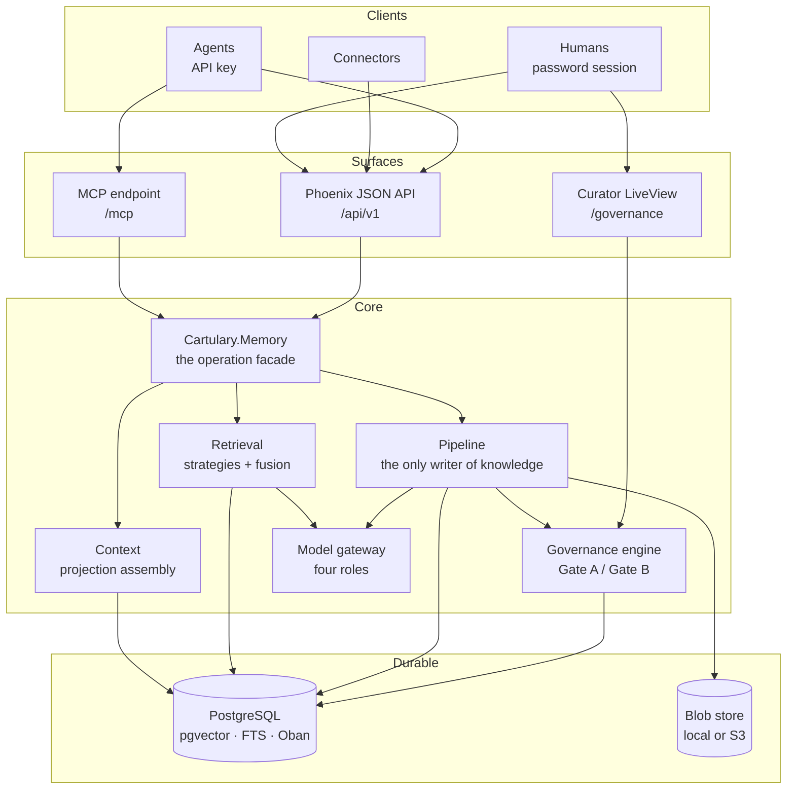
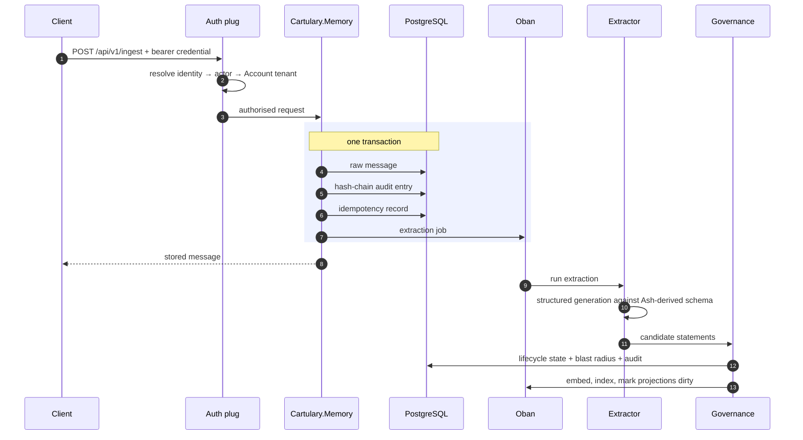

<!-- SPDX-License-Identifier: Cartulary-Sustainable-Use-1.0 -->

# System overview

Cartulary is one Elixir/OTP release: a Phoenix HTTP surface, an Ash domain
model, Oban background jobs, and PostgreSQL with pgvector and full-text search.
There is no second runtime, no separate worker fleet, and no service mesh.

## The four rules that shape everything

**1. Context flows down freely; knowledge flows up only through a gate.**
A scope inherits everything its ancestors know. Nothing travels the other way
without an explicit decision.

**2. Agents submit raw observations; the pipeline is the sole writer of
knowledge.** There is no HTTP route, no MCP tool, and no SDK call that writes a
statement into memory. A compromised or confused agent can record misleading
*observations*, but it cannot edit memory.

**3. Blast radius scales the bar.** The wider the audience for a statement, the
higher the confidence required, the stricter the sensitivity handling, and the
more consent needed.

**4. Knowledge is the only atom.** Profiles, scope cards, and session summaries
are projections recomputed from knowledge. They can be thrown away and rebuilt;
knowledge cannot.

## The shortest path through the system

An ingest touches nearly every part:

Either all four writes in the transaction commit or none do, so a crash can
never leave an audit gap or an orphaned job. A provider outage stops extraction,
not the observation: the raw message is durable and the job retries.

## Durable versus rebuildable

This distinction decides what a backup must contain and what an erasure must
recompute.

| Durable — the system of record | Rebuildable — derived caches |
| --- | --- |
| Raw messages | Context projections |
| Governed knowledge | Entity rows and mentions |
| Document versions and their original blobs | Document chunks |
| The hash-chain audit log | Vector and full-text indexes |
| Usage ledger entries | HNSW state, ETS counters |

Anything in the right column may be deleted and recomputed. Nothing in the left
column may.

## Where to go next

| Page | What it explains |
| --- | --- |
| [Memory model](memory-model.md) | Accounts, scopes, peers, knowledge, and the lifecycle states |
| [Ingest pipeline](ingest-pipeline.md) | How an observation becomes a candidate statement |
| [Governance gates](governance.md) | What Gate A and Gate B actually decide |
| [Retrieval and context](retrieval.md) | Strategies, fusion, profiles, and projections |
| [Documents and connectors](documents.md) | Files, versions, chunks, and sync |
| [Skill readiness](skills.md) | Requirement cards and gap reports |
| [Isolation and access control](security-model.md) | Tenancy, roles, and what machines may never do |
| [Deployment modes](deployment-modes.md) | Supervised PostgreSQL versus operator-run |
