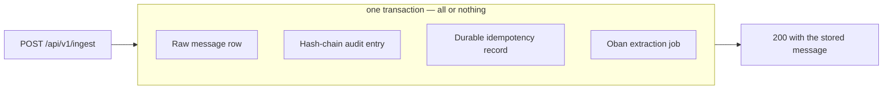
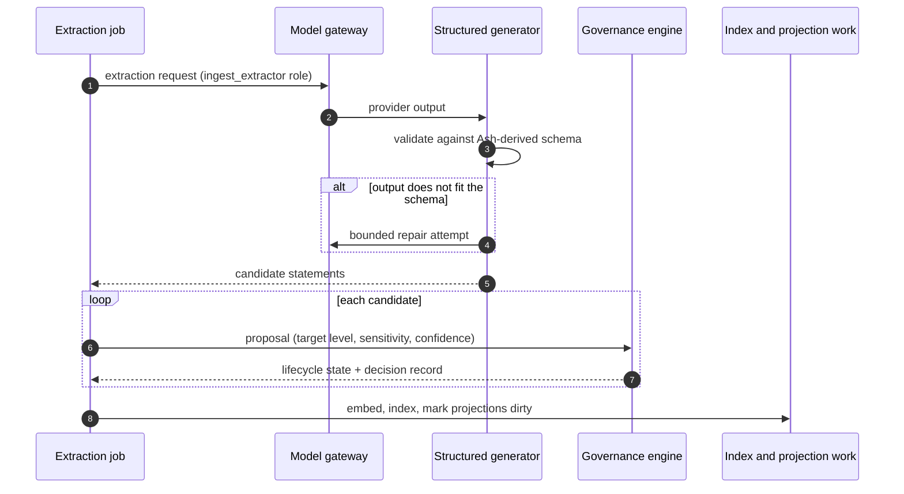

<!-- SPDX-License-Identifier: Cartulary-Sustainable-Use-1.0 -->

# Ingest pipeline

The pipeline is the only writer of knowledge. Understanding it is mostly
understanding two things: what commits together, and what happens later.

## What commits together

An ingest request writes four things in **one** database transaction:

Either all four commit or none do. That rules out the two failure modes that
make an audited system untrustworthy: an observation with no audit entry, and a
job with no observation behind it.

Job insertion is transactional because Oban runs on the same PostgreSQL
database. An external broker or an in-memory queue could not participate in
this transaction, which is why there is no second queue technology anywhere in
Cartulary.

## What happens after the response

Extraction runs inline by default and can be moved to the background with
`sync_extract: false`. Either way, the work is the same:

### Structured extraction, not free text

Candidates are generated against a schema derived from the Ash resources that
will store them. Output that does not fit gets a bounded repair attempt and is
then rejected — malformed provider output is never stored as if it were valid.

Extraction also does three things a naive extractor gets wrong:

- **Resolves subject independently of source.** Who a statement is about is
  decided on its own, not assumed to be the speaker.
- **Discounts hearsay.** "Dana said the deadline moved" is weaker evidence about
  the deadline than Dana saying it.
- **Records complete provenance.** Provider, model, version, prompt, and
  pipeline identity travel with the result.

### Replay is safe

Every job carries a deterministic idempotency key. Replaying an ingest **merges
provenance** into the existing statement instead of creating a duplicate — the
second sighting makes the statement better corroborated, not doubled.

Durable records whose job never ran are picked up by a reconciler lane, so a
crash between commit and execution self-heals.

### A provider outage delays freshness; it does not lose data

If the model provider is down, step 1 above fails. The raw observation is
already durable and the job retries. Nothing is dropped, and nothing silently
downgrades to a deterministic stand-in — production refuses to fall back to the
local test adapter after a live provider error, because a silent quality
downgrade is worse than a visible delay.

## The job lanes

Background work is split into named Oban queues, each with its own concurrency
limit:

| Queue | Concurrency | What runs there |
| --- | --- | --- |
| `ingest` | 10 | Message and document extraction — the user-facing lane |
| `dream` | 2 | Background reasoning over already-governed knowledge |
| `lifecycle` | 2 | Revalidation and expiry sweeps |
| `projection` | 2 | Context, scope, and session projection rebuilds; entity resolution |
| `governance` | 2 | Validation continuations and answer correlation |
| `connector` | 2 | External connector polling and sync |
| `portability` | 1 | Rebuild work after a logical archive import |
| `reconciler` | 1 | Durable records whose job never ran |

Portability and reconciliation are serialised to one at a time because each
walks an entire Account.

Background jobs run through Ash actions **with authorisation on**, exactly like
an HTTP caller. A job is not a privilege-escalation path.

## Dream-time

Some work is too expensive to do while a user waits: consolidating duplicate
statements, resolving entity references, deciding what to revalidate, and
preparing validation questions. That work runs in the `dream` lane, and it is
the first thing throttled when a token budget tightens.

Dream-time reads governed knowledge and proposes; it does not bypass the gates.

## What never enters audit metadata or job arguments

Audit entries and Oban arguments carry ids, states, levels, channels, flags,
counts, and content hashes. They never carry statement text, message content,
document bytes, extracted text, prompts, answers, connector cursors, or
secrets.

This is what makes the audit log safe to retain after an erasure: the evidence
that a decision happened survives, while the content it was about does not.
