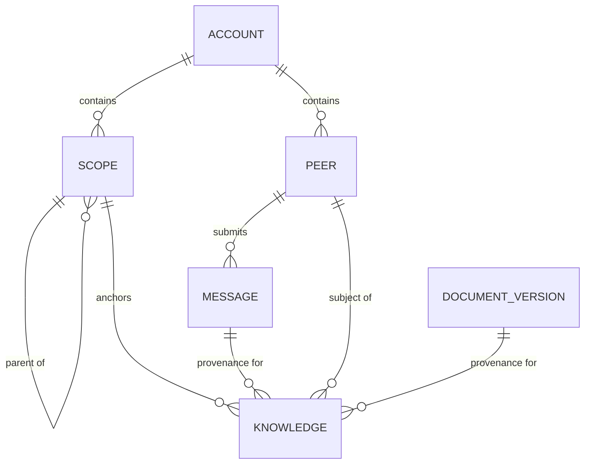
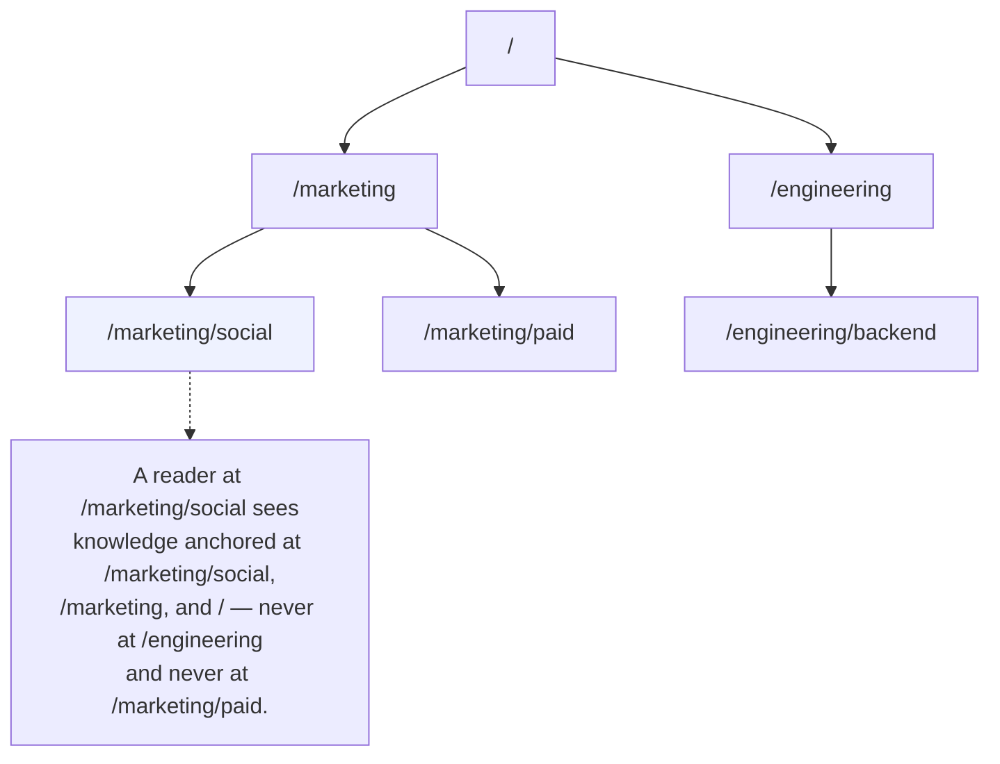
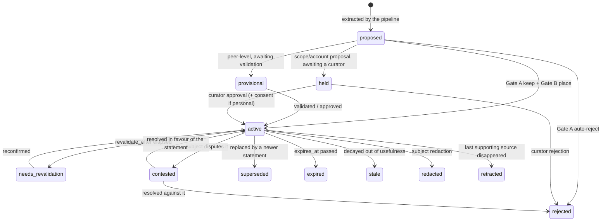

<!-- SPDX-License-Identifier: Cartulary-Sustainable-Use-1.0 -->

# Memory model

Everything Cartulary stores hangs off four structures — Account, Scope, Peer,
and Knowledge — plus the raw observations knowledge is derived from.

## Account — the isolation boundary

Every durable row belongs to exactly one Account. The Account is derived from
the authenticated identity and is enforced three times over: at the Phoenix
edge, in Ash policies, and in PostgreSQL row-level security. With no Account
set on a transaction, the row-level policy matches no rows at all.

No header, query parameter, or request body field selects tenancy. An older
`x-cartulary-account-key` header and `account_key` fields in request bodies are
accepted and *ignored*, so an outdated client fails closed into its own Account
rather than reaching into someone else's.

The community build serves a single Account. Multi-Account operation is an
enterprise concern.

## Scope — the containment tree

A scope is a path such as `/marketing/social`. Scopes nest, and **inheritance
is downward and nearest-wins**: anything attached to `/marketing` is visible at
`/marketing/social`, and a value set on the child overrides the same value
inherited from the parent.

A search at a scope selects that scope *and its ancestors*, because context
flows downward. It never selects siblings or descendants.

## Peer — one participant

A peer is a human or an agent. Humans authenticate with a password and receive
a short-lived bearer token; agents hold a hashed per-peer API key. Peers are
the narrowest audience knowledge can have.

The distinction matters for authority, not just identity: only human peers can
make curator decisions. See
[Isolation and access control](security-model.md).

## Knowledge — the only durable atom

One knowledge item is one natural-language statement plus the metadata that
governs it:

| Field group | What it records |
| --- | --- |
| Statement | The text. **Immutable once written** — a change mints a new row and supersedes the old one. |
| Subject | Who or what the statement is *about*. |
| Provenance | Which messages or document versions support it, and how many independent sources. |
| Confidence | How sure the system is. |
| Sensitivity | How exposed the statement may be. |
| Belief time | `inserted_at`, `revalidate_after`, `expires_at` — when the system holds the claim. |
| Valid time | `relevant_from`, `relevant_until` — when the claim is true in the world. |
| State | The governance lifecycle position. |
| Verification | *Why* the last transition happened: an automatic gate keep, a curator approval, a subject dispute. |

Three independence rules follow from that table and are easy to get wrong:

- **Subject is not source.** An agent talking about a colleague produces a
  statement whose subject is the colleague and whose source is the agent.
- **Belief time is not valid time.** A fact can be freshly learned and long
  expired, or old and still true.
- **Confidence is not sensitivity.** Being very sure of something does not
  license sharing it more widely.

## Lifecycle states

Every extracted statement starts as `proposed` — the create action refuses any
other starting state. Governance moves it from there, and **retrieval filters
on state**, so the state alone decides whether anyone ever sees a statement.

| State | Retrievable? | Meaning |
| --- | --- | --- |
| `proposed` | No | Just extracted; no gate decision yet. |
| `provisional` | Only by the peer it came from | A peer-level item awaiting validation. |
| `held` | No | A scope- or account-level proposal parked at its source scope. |
| `active` | Yes | Governed, visible within its scope. |
| `needs_revalidation` | Treated as a gap | Its revalidation date has passed. |
| `contested` | Restricted | The subject disputes it. |
| `superseded` | No | A newer statement replaced it; retained as history. |
| `expired` | No | Its validity window closed. |
| `stale` | No | Decayed below usefulness. |
| `rejected` | No | Kept as evidence of the decision, never retrieved. |
| `redacted` | No | Removed at the subject's request. |
| `retracted` | No | Its last supporting source disappeared. |

Only the lifecycle `transition` action may change state, and it always writes a
lifecycle event and an audit entry in the same transaction. Nothing updates the
state attribute directly.

## Projections are not a second store

A peer profile, a scope card, and a session summary look like stored documents
but are not. Each is a **projection** recomputed from governed knowledge, held
as a cache, marked dirty when its inputs change, and rebuilt in the background.
Delete them all and Cartulary loses nothing but time.

This is why `get_context` is cheap and repeatable: it reads projections and
never calls a reasoning model.

## What is durable

| Durable | Rebuildable |
| --- | --- |
| Raw messages | Context projections |
| Governed knowledge | Entity rows and mentions |
| Document versions and original blobs | Document chunks |
| Hash-chain audit log | Vector and full-text indexes |
| Usage ledger | HNSW state, ETS counters |

Backups must capture the left column together with the blob store; the right
column is regenerated. See [Backup and restore](../operations/backup-restore.md).
