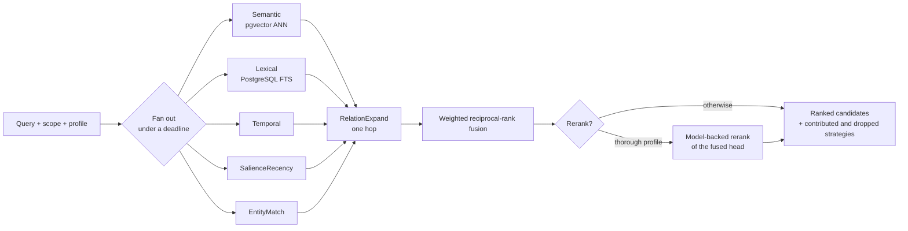
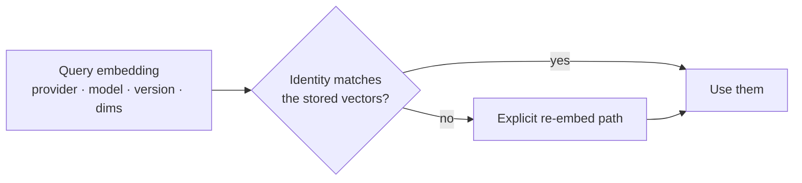
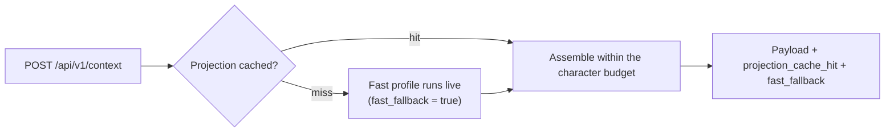

<!-- SPDX-License-Identifier: Cartulary-Sustainable-Use-1.0 -->

# Retrieval and context

Cartulary does not have "a" retrieval algorithm. It runs several independent
candidate generators in parallel, merges their rankings, and optionally reranks
the head of the merged list — all under a hard wall-clock deadline.

## Filtering happens before candidates leave retrieval

Account, authorised scope, lifecycle state, provisional-subject, and source
filters are applied **inside** each strategy's query, not afterwards. Nothing
that a caller is not entitled to see is ever materialised and then removed.

This is why the API layer never post-filters, and why adding a post-filter
would be a symptom of a bug rather than a safety net.

## Why fusion, and why you must not re-sort

Each strategy scores in its own space: cosine distance, full-text rank, time
relevance, salience, mention confidence. Those numbers are **not comparable**.

Fusion therefore merges *ranks*, not scores. A candidate at rank `r` in one
strategy's list contributes `weight / (k + r)`, with `k = 60` — the
conventional value, kept so results stay comparable with recorded evaluation
baselines. A large `k` flattens the curve so one strategy's single top hit
cannot dominate the merge.

!!! warning "The returned order is the answer"
    Re-sorting the returned candidates by a raw per-strategy score compares
    numbers from different scoring spaces and silently degrades results.

Strategy disagreement is computed *before* fusion, so it measures what the
strategies actually thought rather than an artefact of the merge.

## Profiles

A profile is a named, versioned bundle: which strategies run, their fusion
weights, whether the head is reranked, and the deadline.

| Profile | Strategies | Rerank | Deadline | Used by |
| --- | --- | --- | --- | --- |
| `fast` | semantic, salience-recency | no | 100 ms | The only profile allowed to run live when context assembly misses its projection cache |
| `balanced` | semantic, lexical, temporal, entity-match | no | 300 ms | Default for `search` |
| `thorough` | all six, including one-hop relation expansion | yes | 1500 ms | Default for `ask` |

Profiles inherit down the scope tree, nearest-wins, so a scope can tighten or
loosen retrieval without a global change. The profile version travels back with
every result as `profile_version`.

`deadline_ms` is a hard ceiling covering strategy execution *and* reranking. A
strategy that misses it is dropped from the result, never retried, and the
response reports it as dropped. Raising the deadline trades tail latency for
recall.

An operator-level allowlist can switch off an expensive strategy across the
whole deployment: a strategy absent from it never runs, whatever a profile
asks for.

Raw per-request strategy overrides are internal and evaluation-only; external
callers cannot select strategies directly.

## Entities are internal

Entity resolution gives statements canonical referents so that "Dana", "Dana R."
and "our copy lead" can match each other. It runs at dream-time over already
validated statements.

Entity rows and mentions are **rebuildable, pipeline-internal caches**, and
they are exposed through no public surface at all — not HTTP, not MCP, not the
SDK helpers, not LiveView, not projection payloads, not retrieval responses.

That containment is what bounds the cost of a mistake: a bad resolution costs
accuracy and can never move information across a scope or Account boundary.
Erasure and archive import recompute entities from surviving governed
statements.

## Cross-scope expansion is authorised twice

Scope relations and shared-entity edges can expand retrieval into a linked
scope — but only after **both** endpoint scopes pass the caller's
authorisation. A cross-link never grants access; it only follows access the
caller already has.

## Vectors carry an identity

An embedding is stored with its provider, model, version, and dimensions. Those
four values together are the vector-space identity.

A mismatch never silently substitutes or reuses vectors — the numbers are only
comparable within one pinned identity. Bump the embedding version whenever the
model artefact, tokenizer, pooling, or dimensions change.

## Context assembly is reasoning-free

`get_context` is a different operation from `search`. It assembles a budgeted
context payload — governed knowledge, a session summary, scope cards, and a
peer profile — from **projections**, and it never calls a generation model.

Two diagnostic flags come back with every response: `projection_cache_hit` says
a stored projection was reused, and `fast_fallback` says the projection was
missing and the fastest retrieval profile filled in live.

Projection changes preserve dirty marking, bounded delta compaction, source
ids, and cache invalidation over PubSub and ETS. Introducing a model call into
this path would turn a projection read into an inference and break the
guarantee that context assembly is cheap and repeatable.

## Ask abstains

`ask` retrieves with the `thorough` profile, restricts retrieval to knowledge
items so that citations are governed statements, and answers over what it
found. When nothing supports the question it sets `abstained` and returns no
answer.

Treat `abstained == true` as an ordinary outcome. An answer invented from an
empty candidate set would be worse than silence.
