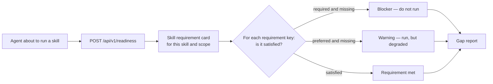
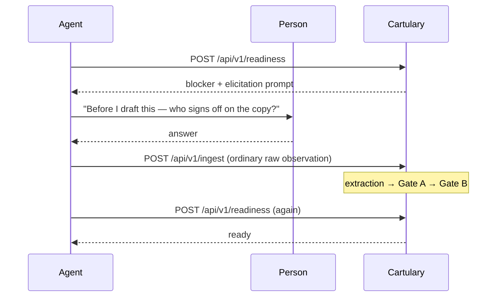

<!-- SPDX-License-Identifier: Cartulary-Sustainable-Use-1.0 -->

# Skill readiness

Most memory systems answer "what do I know?". Skill readiness answers a
different and more useful question before an agent acts: **"do I know enough to
do this properly, and if not, exactly what am I missing?"**

## Requirement cards are procedural memory, not knowledge

A skill requirement card is **human-authored** and **plainly versioned**. It
does not pass Gate A or Gate B, because it is not a claim about the world — it
is a statement of what a task needs.

Requirement keys inherit down the scope tree with **nearest-scope overrides**,
so `/marketing/social` can require something extra that `/marketing` does not,
or relax something it does.

Cards are authored by humans in the governance console.

## What can satisfy a requirement

Only two things:

- authorised `active` knowledge, or
- the calling peer's own usable `provisional` knowledge.

Everything else is a gap. In particular, `expired`, due-for-revalidation, and
`needs_revalidation` items are gaps **immediately** — not after some background
sweeper eventually notices. Stale knowledge quietly satisfying a requirement is
exactly the failure mode this feature exists to prevent.

## Blockers and warnings

| Requirement kind | Unmet effect |
| --- | --- |
| Required | **Blocker.** `ready` is false; the helper must not run. |
| Preferred | **Warning.** `ready` stays true; the caller proceeds knowingly. |

`ready` is true exactly when there are no blockers.

## Closing a gap

A gap marked `ask-peer` or `either` may produce an elicitation prompt — a
question the agent can put to the person.

The answer comes back through **ordinary ingest** and passes governance before
readiness is checked again. There is no path from "an agent asked a question"
to "a fact is in memory" that skips the pipeline.

!!! danger "A gap report is not advisory"
    An SDK helper must never override a server blocker, and must never write
    the missing knowledge directly. If it could, the whole check would be
    theatre.

## The report is reasoning-free

Generating a gap report calls no model. It is a deterministic evaluation of
requirement keys against governed knowledge, which is what makes it cheap
enough to run before every skill invocation.

The report carries its own contract identity in `report_version`, so a client
can tell which selector language and report shape it is reading.

See [Checking skill readiness](../guides/skill-readiness.md) for the request
and response, and [SDK helpers](../guides/sdk-helpers.md) for the Python and
TypeScript wrappers.
