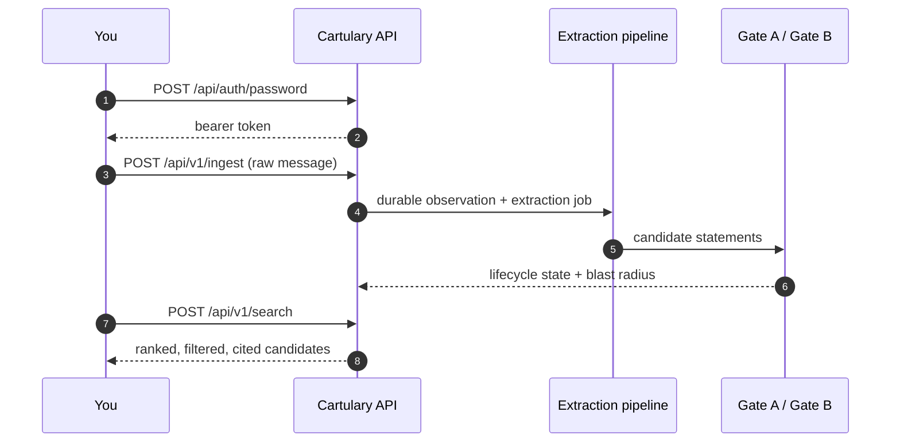

<!-- SPDX-License-Identifier: Cartulary-Sustainable-Use-1.0 -->

# Quickstart tutorial

Five minutes, five steps: sign in, record an observation, watch it become
governed knowledge, read it back, and check what an agent still needs to know.

This assumes a running instance — see [Getting started](index.md) — reachable
at `http://127.0.0.1:4000`.



## 1. Bootstrap an administrator

Only needed once. It creates the community Account, registers a human
administrator, grants the administrator role on the root scope, and prints a
bearer token valid for 12 hours.

=== "From source"

    ```bash
    CARTULARY_BOOTSTRAP_PASSWORD='replace-with-a-long-password' \
      mix cartulary.identity.bootstrap \
        --email admin@example.test \
        --name 'Local Admin'
    ```

=== "From an unpacked release"

    A release contains no Mix tasks, so call the same function directly:

    ```bash
    bin/cartulary rpc '
      r = Cartulary.Identity.bootstrap_human(%{
            email: "admin@example.test",
            name: "Local Admin",
            password: System.fetch_env!("CARTULARY_BOOTSTRAP_PASSWORD")
          })
      IO.puts("peer=#{r.peer.id} token=#{r.token}")'
    ```

There is deliberately no default password: an installation that came up with a
known credential would be reachable by anyone who read the source. The printed
token is not recoverable afterwards — copy it now, keep it out of logs and
chat, and sign in with the password once it expires.

## 2. Sign in

```bash
curl -fsS -X POST http://127.0.0.1:4000/api/auth/password \
  -H 'content-type: application/json' \
  -d '{"email":"admin@example.test","password":"replace-with-a-long-password"}'
```

The response carries a bearer token. Export it:

```bash
export TOKEN='<token from the response>'
```

A wrong email and a wrong password produce the same opaque 401, so the endpoint
cannot be used to discover which accounts exist.

## 3. Record an observation

This is the only write path an agent has. You are not writing knowledge — you
are recording what was said, and handing it to the pipeline.

```bash
curl -fsS -X POST http://127.0.0.1:4000/api/v1/ingest \
  -H "authorization: Bearer $TOKEN" \
  -H 'content-type: application/json' \
  -d '{
        "session_id": "quickstart-1",
        "scope_path": "/marketing/social",
        "content": "We publish the weekly roundup on Thursday mornings, and Dana signs off on the copy."
      }'
```

Missing scopes, the session, and its links are created on demand, so you do not
have to provision topology first.

The response is the stored message. Because extraction runs inline by default,
it also carries a `knowledge` list of the statements the pipeline just proposed
— pipeline output, not your input. Nothing in your request body can mint
knowledge.

## 4. Read it back

```bash
curl -fsS -X POST http://127.0.0.1:4000/api/v1/search \
  -H "authorization: Bearer $TOKEN" \
  -H 'content-type: application/json' \
  -d '{"query":"when does the roundup go out","scope_path":"/marketing/social"}'
```

You get a fused ranking from several independent retrieval strategies, along
with which strategies contributed and which were dropped against the deadline.
The order returned *is* the answer — re-sorting by a per-strategy score
compares numbers from different scoring spaces.

For a written answer with citations:

```bash
curl -fsS -X POST http://127.0.0.1:4000/api/v1/ask \
  -H "authorization: Bearer $TOKEN" \
  -H 'content-type: application/json' \
  -d '{"question":"Who approves the weekly roundup copy?","scope_path":"/marketing/social"}'
```

If nothing supports the question, `abstained` is `true` and there is no answer.
That is a correct outcome, not an error.

## 5. Check readiness before running a skill

```bash
curl -fsS -X POST http://127.0.0.1:4000/api/v1/readiness \
  -H "authorization: Bearer $TOKEN" \
  -H 'content-type: application/json' \
  -d '{"skill":"write-copy","scope_path":"/marketing/social"}'
```

The report splits unmet requirements into `blockers` and `warnings`. `ready` is
true exactly when there are no blockers.

A gap is not permission to invent the missing fact. The answer comes back
through ordinary ingest and passes governance before readiness improves.

## What just happened to your data

The statement extracted in step 3 did **not** become account-wide fact. By
default it is visible to the peer who submitted it, as `provisional` knowledge.
Promoting it to the scope or the whole Account is a separate, human decision —
see [Governance gates](../concepts/governance.md) and
[Curating memory](../guides/governance-console.md).

## Next

- [How it works](../concepts/index.md) — the model behind what you just did.
- [HTTP API reference](../reference/http-api.md) — every parameter.
- [Connecting an MCP client](../guides/mcp.md) — point a real agent at it.
