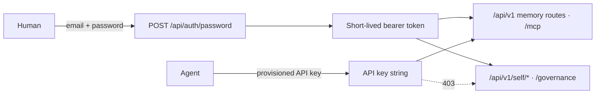

<!-- SPDX-License-Identifier: Cartulary-Sustainable-Use-1.0 -->

# Authentication

Every `/api/v1` route and the MCP endpoint require
`Authorization: Bearer <credential>`. There are two kinds of credential, and
which one you hold decides what you may do.



## Human sign-in

```bash
curl -fsS -X POST http://127.0.0.1:4000/api/auth/password \
  -H 'content-type: application/json' \
  -d '{"email":"admin@example.test","password":"..."}'
```

The response carries a bearer token. A wrong email and a wrong password produce
the same opaque 401 — the endpoint cannot be used to discover which accounts
exist.

Use the token as:

```
Authorization: Bearer <token>
```

## Agent API keys

An agent holds a per-peer API key, sent in exactly the same header. Keys are
stored hashed; the plaintext exists only at the moment it is issued, so record
it then.

An API key is enough for the memory routes and MCP. It is **not** enough for:

- `/api/v1/self/*` — self-view, contest, redact, erase;
- `/governance` — the curator console.

Both return 403 for a machine credential even when it belongs to the same peer
as a human identity. Those are personal decisions a machine may not take on a
person's behalf.

## The Account comes from the credential

You do not choose an Account. It is derived from the verified identity and
installed as the tenant for the whole request.

An `account_key` field in a request body and the legacy
`x-cartulary-account-key` header are accepted and **ignored**, so an old client
fails closed into its own Account rather than reaching into someone else's.

## Roles

| Role | Typical use |
| --- | --- |
| `account-admin` | Operations, cost visibility, gate-rule administration |
| `curator` | Approve, edit, reject, merge, defer proposals |
| `member` | Ordinary read and ingest |
| `reader` | Read only |

Grants attach to a scope, propagate downward when configured to, and resolve
**deny-wins**: any applicable deny removes access to that scope.

## Bootstrapping the first identity

See the [Quickstart](../getting-started/quickstart.md#1-bootstrap-an-administrator).
The bootstrap task creates the community Account, the first human
administrator, and an administrator role grant on the root scope, then prints a
bearer token valid for 12 hours. That token is not recoverable afterwards.

## Trace correlation

Every response carries an `x-trace-id` header. If you send a W3C `traceparent`,
your trace id is retained; if you do not, a new request trace id is generated.
Use it when correlating a client-side failure with server telemetry — see
[Observability](../operations/observability.md).
