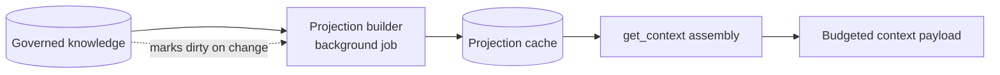

<!-- SPDX-License-Identifier: Cartulary-Sustainable-Use-1.0 -->

# Assembling context

`POST /api/v1/context` assembles model-free scope context within a character
budget.

```bash
curl -fsS -X POST http://127.0.0.1:4000/api/v1/context \
  -H "authorization: Bearer $TOKEN" \
  -H 'content-type: application/json' \
  -d '{
        "scope_path": "/marketing/social",
        "session_id": "campaign-review-12",
        "budget_chars": 6000
      }'
```

| Field | Default | Notes |
| --- | --- | --- |
| `scope_path` | `"/poc"` | Selects this scope and its ancestors. |
| `session_id` | none | Picks the session summary to include. |
| `budget_chars` | unset | Caps the assembled size. |

## The response

```json
{
  "data": {
    "knowledge": [ ... ],
    "session_summary": { ... },
    "scope_cards": [ ... ],
    "peer_profile": { ... },
    "profile_version": "f7-1",
    "projection_cache_hit": true,
    "fast_fallback": false
  }
}
```

- **`knowledge`** — governed statements in scope, within budget.
- **`session_summary`** — a projection of this session so far.
- **`scope_cards`** — what each ancestor scope contributes.
- **`peer_profile`** — a projection about the calling peer.
- **`projection_cache_hit`** — a stored projection was reused.
- **`fast_fallback`** — the projection was missing, so the `fast` retrieval
  profile filled in live.

## Why this is not just a search

Profiles, scope cards, and session summaries are cached **projections** of
governed knowledge, not another durable store.



No generation model runs on this path.

## Interpreting the diagnostic flags

| `projection_cache_hit` | `fast_fallback` | What it means |
| --- | --- | --- |
| `true` | `false` | Normal. Served from a warm projection. |
| `false` | `true` | The projection was missing; live retrieval covered it. Expect this right after ingest, an import, or an erasure. |
| `false` | `false` | Nothing to project yet — a new scope, or genuinely empty. |

Persistent `fast_fallback` means the `projection` job lane is not keeping up.
Check queue depth on `/api/ready`.

## Budgeting

`budget_chars` caps total assembled size. Assembly prefers the most relevant
governed knowledge and the nearest scope's cards, so a tighter budget loses the
most distant context first rather than truncating arbitrarily.

Leave room in the model window for the conversation and user question.

## When to use context versus search

| Use `context` | Use `search` |
| --- | --- |
| Priming an agent before a turn | Answering a specific question |
| "What should I know about this scope?" | "What do we know about X?" |
| Every turn, cheaply | On demand |
| No model call | May rerank with a model (`thorough`) |
