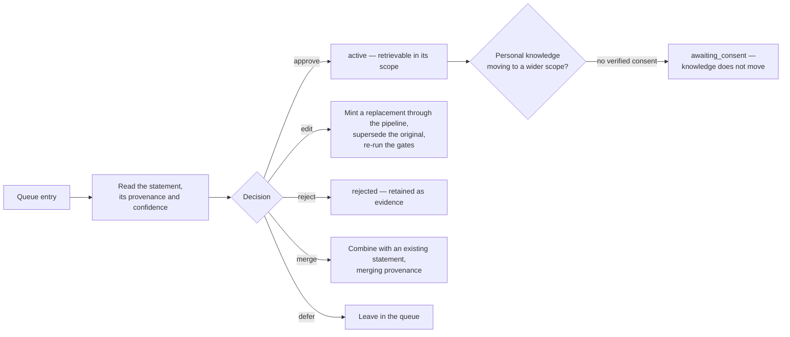

<!-- SPDX-License-Identifier: Cartulary-Sustainable-Use-1.0 -->

# Curating memory

The governance console at `/governance` is where humans decide what the
organisation believes. It is a LiveView application, reachable only by a human
password session holding the `curator` or `account-admin` role.

```bash
open http://127.0.0.1:4000/governance/sign-in
```

## Signing in

Sign-in stores a short-lived token in a signed session cookie. A valid `member`
credential cannot open the console — the controller admits only account-admin
and curator password identities.

The session token, the identity kind, and the role are re-verified on the
initial render **and on every socket reconnect**. Holding the cookie is never
treated as authorisation on its own, because a token can expire or be revoked
while a tab stays open.

There is no machine route into this console. Approve, edit, reject, merge,
defer, promotion, gate-rule administration, and bulk actions exist here and
nowhere else.

## The review queue



Each decision takes a transaction-scoped advisory lock on the queue entry, so
two curators cannot decide the same item concurrently.

### Edit does not mean "type over it"

Curators never write knowledge text directly. An edit **mints a replacement**
through the pipeline-only create action, supersedes the original, and sends the
replacement back through Gate A and Gate B. Curator-authored text clears the
same bar as extracted text.

### Consent cannot be substituted

Approving a scope-level review of a personal item without a granted, verified
consent record parks the entry in `awaiting_consent` and leaves the knowledge
where it was. Curator approval is not consent, and no role can override that.

Consent is granted by the subject, is specific to one target scope, and only
counts when it arrived over a verified channel. A denial is accepted through
any channel.

## Gate rules

The gate matrix is a set of rules keyed by target level and sensitivity, each
naming:

- the Gate A mode (`auto_keep`, `auto_reject`, or human review) and its
  confidence minimum;
- the Gate B mode (`auto_place` or human review) and its corroboration minimum;
- the revalidation interval applied to accepted items.

Lookup order is the item's own scope, then the account-wide rule, then a
built-in cell that demands human review at both gates. **A missing rule falls
back to human judgment, never to auto-activation** — so an empty matrix is
safe, merely laborious.

Start strict. Loosening a cell after watching a week of decisions is easy;
recalling knowledge that auto-activated too eagerly is not.

## Skill requirement cards

The console is also where skill requirement cards are authored. Cards are
human-authored and plainly versioned; they are procedural memory, not
knowledge, and they do not pass the gates. See
[Checking skill readiness](skill-readiness.md).

## What every decision leaves behind

In the same transaction as the decision:

- an immutable decision record naming the gate, the outcome, and the rule cell;
- a lifecycle event;
- a hash-chained audit entry;
- the derived-cache refresh work implied by the new state.

Audit metadata carries ids, states, levels, channels, flags, and the statement
hash — never the statement text. That is what makes the audit trail safe to
keep after an erasure.

## Current limitation

There is no connector administration UI and no Account archive administration
UI in this release; both are driven from the command line. See
[Limitations](../reference/limitations.md).
