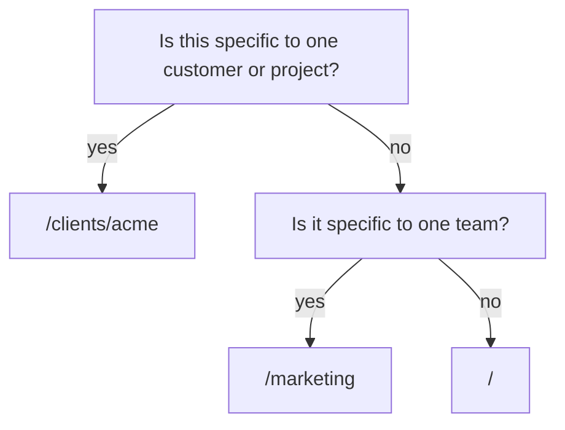

<!-- SPDX-License-Identifier: Cartulary-Sustainable-Use-1.0 -->

# Recording observations

`POST /api/v1/ingest` is the only write path an agent has. You record **what
was said**; the pipeline decides what, if anything, becomes knowledge.

## A minimal request

```bash
curl -fsS -X POST http://127.0.0.1:4000/api/v1/ingest \
  -H "authorization: Bearer $TOKEN" \
  -H 'content-type: application/json' \
  -d '{
        "session_id": "support-4821",
        "scope_path": "/support/tier1",
        "content": "The customer runs PostgreSQL 16 and cannot upgrade before Q4."
      }'
```

## Fields

| Field | Required | Default | Notes |
| --- | --- | --- | --- |
| `session_id` | yes | — | Any stable string. The session and its scope/participant links are created on demand. |
| `scope_path` | yes | — | Created on demand if it does not exist. |
| `content` | yes | — | The raw text of the observation. |
| `role` | no | `"user"` | Who was speaking. |
| `occurred_at` | no | now | When it was said, if backfilling. |
| `sync_extract` | no | `true` | `false` moves extraction to the background. |

You do not have to provision topology first — missing scopes, the session, and
its links are created as part of the request.

## The acting peer comes from your credential

A `peer_key` in the body is honoured only for internal callers that carry no
peer of their own. An authenticated caller cannot attribute an observation to
somebody else.

## What comes back

The response is `{"data": {...}}` holding the stored message. Unless you set
`sync_extract: false`, it also carries a `knowledge` list — the statements the
pipeline just proposed.

!!! note "That list is output, not input"
    Nothing in your request body can mint knowledge. Each proposed item still
    has to clear governance before anyone other than the submitting peer can
    see it.

A typical proposed item is `provisional`: real, visible to you, and not yet
part of what the scope believes. See [Governance gates](../concepts/governance.md).

## Choosing a scope

The scope decides who can eventually see anything extracted from this
observation. Pick the **narrowest** scope that is still correct:



Anything at `/marketing` is visible at `/marketing/social`; nothing at
`/marketing/social` is visible at `/marketing`. Widening later is a governed
decision; narrowing later means the information already travelled.

## Backfilling history

To load past conversations, ingest each message with its real `occurred_at` and
`sync_extract: false`, then let the `ingest` job lane work through them. The
belief-time and valid-time distinction means a backfilled message is correctly
treated as newly *learned* but possibly long *true*.

## Replaying is safe

Every ingest carries a deterministic idempotency key. Re-sending the same
observation merges provenance into the existing statement rather than creating
a duplicate — the second sighting makes the statement better corroborated.

## When the model provider is down

Extraction fails; the observation does not. The raw message is already durable
and the extraction job retries. Nothing falls back to a deterministic stand-in
in production, because a silent quality downgrade would be worse than a visible
delay.

## Ingesting documents

Documents are the other kind of raw observation. They are submitted as document
versions rather than messages, are stored as immutable, hash-addressed
versions with their original bytes, and their extracted knowledge passes the
same pipeline and gates. See
[Documents and connectors](../concepts/documents.md).
