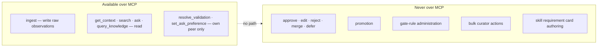
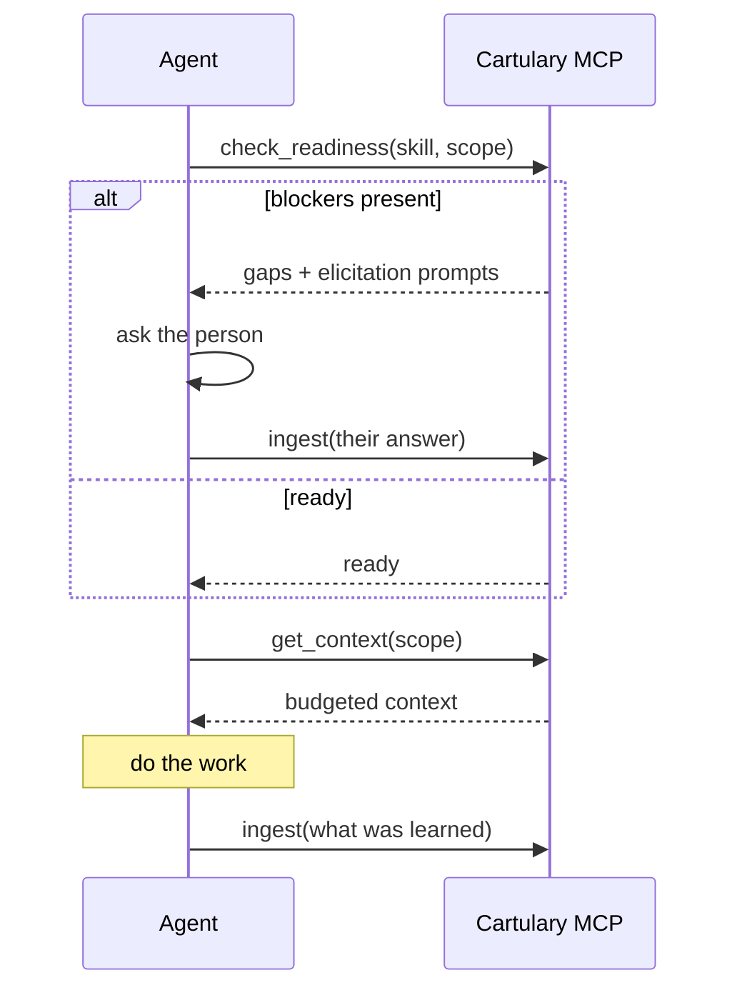

<!-- SPDX-License-Identifier: Cartulary-Sustainable-Use-1.0 -->

# Connecting an MCP client

Cartulary serves a Model Context Protocol endpoint at `/mcp`. It authenticates
exactly like the JSON memory routes — bearer credential in, Account derived
from it — so an MCP client can never reach another tenant's data.

The advertised protocol revision is `2025-03-26`.

## Point a client at it

```json
{
  "mcpServers": {
    "cartulary": {
      "url": "http://127.0.0.1:4000/mcp",
      "headers": {
        "Authorization": "Bearer <api-key-or-token>"
      }
    }
  }
}
```

Use an agent API key for an agent. A human password token works too, but ties
the agent's memory writes to a person's identity, which muddies attribution.

## The complete tool surface

Eight tools. This list is exhaustive by design.

| Tool | What it does |
| --- | --- |
| `ingest` | Submit a raw observation |
| `get_context` | Assemble reasoning-free context for a scope |
| `search` | Ranked retrieval over governed memory |
| `ask` | Cited answer, with abstention |
| `query_knowledge` | List governed knowledge the caller may read |
| `check_readiness` | Skill-readiness gap report |
| `resolve_validation` | Answer the calling peer's own frozen inline question |
| `set_ask_preference` | Lower the calling peer's interruption limits |



There is no approve, edit, reject, merge, defer, promote, or gate-rule tool,
and there must never be one. Adding one would let any API key push knowledge
into shared scopes without a human curator — precisely what the gates exist to
prevent.

## Inline validation

`resolve_validation` lets a peer answer a validation question that was attached
to a read result — confirming or correcting a statement inside the conversation
they are already in, instead of in a console they will never open.

Constraints worth knowing:

- a client may resolve only **its own peer's** frozen question;
- the question selector is deadline-bounded and **fails open**: if it cannot
  pick a question in time, the read returns normally with none attached;
- `set_ask_preference` can only *lower* that peer's interruption limits.

## What an agent should do with this

A reasonable loop:



Ingest what was learned; never assume the agent's own summary of a turn is
knowledge. It becomes knowledge only if the pipeline extracts it and the gates
accept it.

## Troubleshooting

| Symptom | Likely cause |
| --- | --- |
| 401 on every tool call | Missing or malformed `Authorization` header |
| Tools listed but calls return nothing | Credential is valid but the peer has no scope authorisation |
| `ask` always abstains | No governed knowledge in scope yet — check whether items are still `provisional` or `held` |
| Reads are slower than expected | `thorough` profile plus a cold projection cache; see [Retrieval](../concepts/retrieval.md) |

Every response carries `x-trace-id`; use it to correlate with server telemetry.
