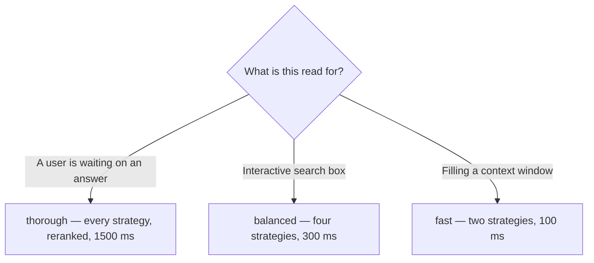

<!-- SPDX-License-Identifier: Cartulary-Sustainable-Use-1.0 -->

# Search and ask

Two read operations, two different jobs. `search` returns ranked evidence.
`ask` returns a written, cited answer over that evidence — and abstains when
there is none.

## search

```bash
curl -fsS -X POST http://127.0.0.1:4000/api/v1/search \
  -H "authorization: Bearer $TOKEN" \
  -H 'content-type: application/json' \
  -d '{
        "query": "who signs off on campaign copy",
        "scope_path": "/marketing/social",
        "profile": "balanced",
        "limit": 12
      }'
```

| Field | Default | Notes |
| --- | --- | --- |
| `query` | `""` | The search text. |
| `scope_path` | `"/poc"` | Selects this scope **and its ancestors**. |
| `profile` | `"balanced"` | `fast`, `balanced`, or `thorough`. |
| `limit` | `12` | Candidate cap. |
| `include_cross_links` | off | Follow scope relations you are authorised for at both ends. |
| `as_of` | now | Read memory as it stood at a point in time. |
| `min_score` | none | Drop weakly fused candidates. |
| `source_filters` | none | Restrict by provenance kind. |
| `deadline` | profile default | `"disabled"` removes the time budget — offline use only. |

### Reading the response

```json
{
  "data": {
    "profile": "balanced",
    "profile_version": "f7-1",
    "candidates": [ ... ],
    "contributed_strategies": ["semantic", "lexical", "entity_match"],
    "dropped_strategies": ["temporal"]
  }
}
```

- `candidates` is **already in the right order.** Do not re-sort by a
  per-strategy score: those scores live in different spaces and comparing them
  degrades results.
- `dropped_strategies` lists strategies that missed the deadline. Frequent
  drops mean the profile's budget is too tight for your data size.
- Account, scope authorisation, and lifecycle filtering already happened inside
  retrieval. You do not need to post-filter.

## ask

```bash
curl -fsS -X POST http://127.0.0.1:4000/api/v1/ask \
  -H "authorization: Bearer $TOKEN" \
  -H 'content-type: application/json' \
  -d '{
        "question": "Who signs off on campaign copy?",
        "scope_path": "/marketing/social"
      }'
```

`question` is required. Every `search` parameter is also accepted, but
`profile` defaults to `thorough` — an answer justifies more latency than a bare
search.

The response is the search payload plus `answer`, `citations`, and `abstained`.

!!! tip "Abstention is a feature"
    When nothing supports the question, `abstained` is `true` and there is no
    answer. Treat it as an ordinary outcome. An answer invented from an empty
    candidate set is worse than silence, and much harder to notice.

Retrieval for `ask` is restricted to knowledge items, so every citation is a
governed statement rather than a raw message.

## Choosing a profile



Profiles inherit down the scope tree, nearest-wins, so a scope can be tuned
without a global change. See [Retrieval and context](../concepts/retrieval.md)
for the exact strategy sets and weights.

## Time travel with `as_of`

`as_of` reads memory as it stood at a moment in the past — useful for auditing
what an agent could have known when it made a decision. It respects belief
time, not valid time: it answers "what did the system believe then", not "what
was true then".

## What you will not find

Entity rows, canonical names, aliases, surface forms, and entity ids are never
returned by any surface. They are internal caches that improve matching; a
resolution mistake therefore costs accuracy and can never move information
across a boundary.
