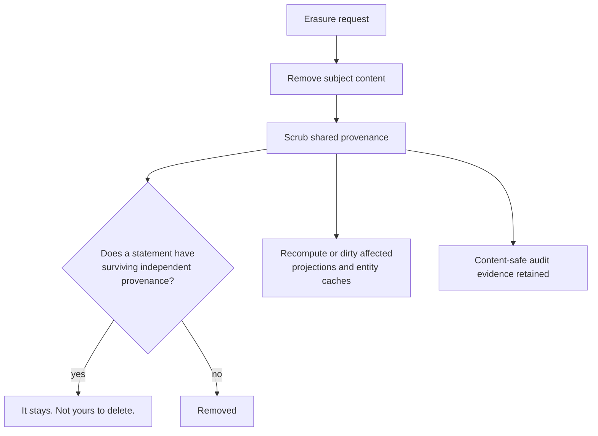

<!-- SPDX-License-Identifier: Cartulary-Sustainable-Use-1.0 -->

# Acting on your own data

`/api/v1/self/*` is the surface a person uses on knowledge about **themselves**.
It requires a human password identity: an agent API key gets 403 even when it
belongs to the same peer, because these are personal decisions a machine may
not take on someone's behalf.

The subject is always the authenticated caller, read from the credential. No
parameter can name a different person, so none of these routes can act on
somebody else.

## See what the system holds about you

```bash
curl -fsS http://127.0.0.1:4000/api/v1/self/knowledge \
  -H "authorization: Bearer $TOKEN"
```

Newest first, skipping already-deleted items. This view includes items that are
still `provisional` or `held` and therefore invisible to ordinary retrieval —
**seeing an item here does not mean anyone else can see it.**

## Contest

```bash
curl -fsS -X POST http://127.0.0.1:4000/api/v1/self/knowledge/<id>/contest \
  -H "authorization: Bearer $TOKEN"
```

The item moves to a contested state marked as disputed by its subject, an
immutable audit entry is written, and a validation item is queued for a human
curator with a 24-hour deadline — long enough for a curator to answer during a
working day, short enough that a disputed claim is not left standing for a
week.

Contesting states an objection. It does not delete or rewrite the claim, and
only a human curator can resolve it.

## Redact

```bash
curl -fsS -X POST http://127.0.0.1:4000/api/v1/self/knowledge/<id>/redact \
  -H "authorization: Bearer $TOKEN"
```

The item moves to a redacted state. Unlike contesting, this queues no review:
the subject's decision stands on its own.

**Redaction is not erasure.** The row survives in a redacted state so history
and audit stay intact.

## Erase

```bash
curl -fsS -X POST http://127.0.0.1:4000/api/v1/self/erasure \
  -H "authorization: Bearer $TOKEN" \
  -H 'content-type: application/json' \
  -d '{"mode":"proportionate"}'
```

| Mode | What it removes |
| --- | --- |
| `proportionate` (default) | Your observations, the knowledge you are the subject of, and your traces scrubbed out of provenance other knowledge still depends on. |
| `strict` | The same, plus knowledge that was only ever sourced through you. |



Neither mode retracts a claim with surviving independent provenance — somebody
else's independently sourced statement is not the subject's to delete.

The response carries only the request's id, mode, and state. Reporting *what*
was removed would re-disclose the very content you asked to have destroyed.

Content-safe audit evidence — ids, hashes, actions, counts — deliberately
survives, because proving that an erasure happened must not require keeping
what was erased.

## Not found means not yours

An unknown id and an id belonging to someone else's knowledge produce the same
not-found response. The two cases are deliberately indistinguishable, so these
routes cannot be used to probe for the existence of other people's records.

## Related

- [Governance gates](../concepts/governance.md)
- [Isolation and access control](../concepts/security-model.md)
