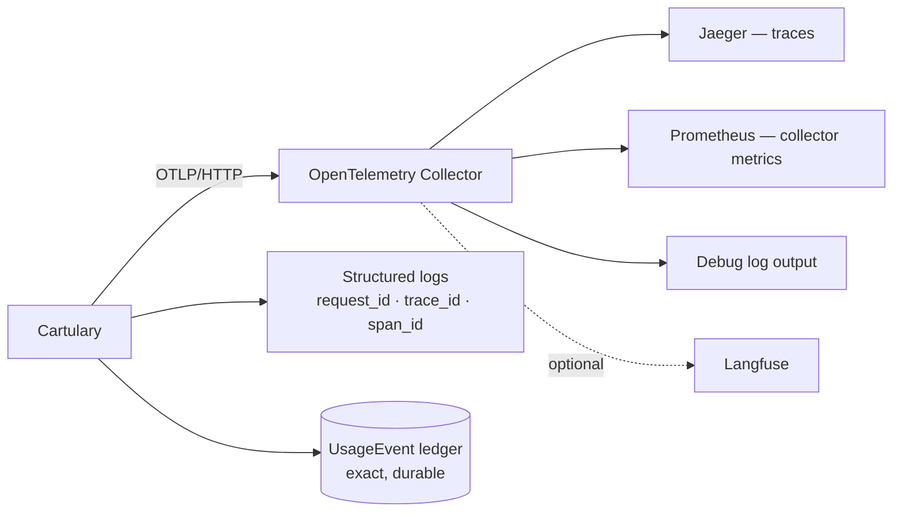

<!-- SPDX-License-Identifier: Cartulary-Sustainable-Use-1.0 -->

# Observability

Cartulary exports OpenTelemetry traces, writes structured logs with trace
metadata, and keeps an exact usage ledger in the database. Export is **disabled
by default** and vendor-neutral: the application speaks OTLP to a collector you
control.



## Turn it on

```bash
CARTULARY_OTEL_ENABLED=true
OTEL_SERVICE_NAME=cartulary-dev
OTEL_EXPORTER_OTLP_ENDPOINT=http://localhost:14318
```

A local collector stack — collector, Jaeger, Prometheus — ships with the
repository:

```bash
docker compose -f dev/observability/docker-compose.yml up
```

Traces are then at `http://localhost:16686` under service `cartulary-dev`, and
collector metrics at `http://localhost:9090`.

The collector receives OTLP/HTTP from the host on port `14318` and forwards to
the standard container port `4318`. The non-standard host port avoids the
common local `4318` conflict; override `CARTULARY_OTEL_HTTP_PORT` if needed.

With the container path, the same stack is a Compose profile:

```bash
CARTULARY_OTEL_ENABLED=true docker compose --profile observability up --build
```

## Correlating one request

Every HTTP response carries `x-trace-id`, and `x-span-id` when a span is
active. A caller supplying a W3C `traceparent` keeps its own trace id; a caller
without one gets a fresh request trace id.

Copy `x-trace-id` from any response and search it in Jaeger. Logger metadata
carries `request_id`, `trace_id`, and `span_id`, so the same identifier joins
logs and traces.

## What is traced

Manual workflow spans:

| Span | Covers |
| --- | --- |
| `cartulary.memory.ingest_message` | Recording a raw observation |
| `cartulary.memory.extract_message` | Extraction of candidates |
| `cartulary.memory.query_knowledge` | Governed knowledge listing |
| `cartulary.memory.search` | Ranked retrieval |
| `cartulary.memory.ask` | Cited answer |
| `cartulary.memory.get_context` | Projection assembly |
| `cartulary.model.chat` / `.structured` / `.embed` / `.rerank` | Model gateway calls |
| `cartulary.documents.process_version` | Document parsing and derivation |
| `cartulary.documents.sync_connector` | Connector sync |

Model spans carry operation, role, provider, model, version, duration, and
token usage. Document spans carry version id, parser, byte/chunk/knowledge
counts, connector id, item count, and duration.

## Reading a failed model call

A failed model call sets `error.type` on its span and writes the same string as
the error class on its usage event. When the call itself failed — a timeout, a
rejected credential, a rate limit — that string is the exception's module name.

A call can also return HTTP 200 and still carry no usable answer, which is what
a hosted aggregator does when its own upstream failed part-way. These four
classes name that case, and they call for different responses:

| Error class | What happened | What to do |
| --- | --- | --- |
| `provider_upstream_error` | The endpoint accepted the request and then failed, cancelled, or cut the response short | Nothing. The job retries and normally succeeds. Investigate only if the rate is high or sustained |
| `provider_output_truncated` | The answer hit the output cap before it was complete | Raise `CARTULARY_MODEL_MAX_TOKENS`, or lower `CARTULARY_MODEL_REASONING_EFFORT` so less of the budget goes to reasoning. Retrying alone repeats this identically |
| `provider_content_filtered` | The endpoint withheld the answer | Retrying repeats it. The input or the model has to change |
| `missing_structured_object` / `missing_text_response` | The call finished normally and returned nothing usable — typically a model answering in prose instead of returning the structured result it was asked for | Check that the configured model supports tool calling or structured output |

An extraction that fails this way leaves the raw observation stored and the
knowledge simply not yet extracted; the job retries and nothing is lost.

## Span controls

Tune noise per debugging session:

| Setting | Default | Effect |
| --- | --- | --- |
| `CARTULARY_OTEL_HTTP_SPANS_ENABLED` | `true` | One server trace per HTTP request |
| `CARTULARY_OTEL_PHOENIX_SPANS_ENABLED` | `true` | Phoenix route naming |
| `CARTULARY_OTEL_MEMORY_SPANS_ENABLED` | `true` | The workflow spans above |
| `CARTULARY_OTEL_MODEL_SPANS_ENABLED` | `true` | Model gateway spans |
| `CARTULARY_OTEL_DOCUMENT_SPANS_ENABLED` | `true` | Document and connector spans |
| `CARTULARY_OTEL_OBAN_SPANS_ENABLED` | `true` | Background job spans |
| `CARTULARY_OTEL_ECTO_SPANS_ENABLED` | `false` | Deep database spans — many, low-level |
| `CARTULARY_OTEL_DB_STATEMENT_ENABLED` | `false` | SQL statement text; off because statements can carry sensitive values |

## Traces are a sampled mirror; the ledger is exact

For anything that must be exactly right — token totals, request counts, cost —
read the `UsageEvent` ledger through
[`/api/v1/operations/costs`](health-and-costs.md).
Telemetry is sampled and is a diagnostic aid, not an accounting record.

## Content safety is not configurable

Traces, logs, telemetry, audit metadata, and job arguments may record ids,
counts, profile names, model names, strategy names, timings, token counts, and
error classes.

They must **never** record raw messages, prompts, answers, API keys, account
keys, peer keys, restricted knowledge, document bytes, extracted text,
connector cursors, source metadata, or secrets.

Production structured logs retain only a reviewed metadata allowlist. If you
add an attribute, that is a disclosure decision, not a formatting one.

## Sending traces elsewhere

Any OTLP-compatible backend works. To forward to Langfuse directly rather than
through the local collector:

```bash
OTEL_EXPORTER_OTLP_TRACES_ENDPOINT=https://cloud.langfuse.com/api/public/otel/v1/traces
OTEL_EXPORTER_OTLP_TRACES_HEADERS=Authorization=Basic <base64 public:secret>
```

Prefer the local collector during development so traces can also be inspected
locally.

The measurement discipline behind evaluation runs — experiment labelling,
retrieval variants, and what may be claimed from a trace — is maintainer
material and lives in the repository under
[`specs/observability/`](https://github.com/cartularyhq/cartulary/tree/main/specs/observability).
