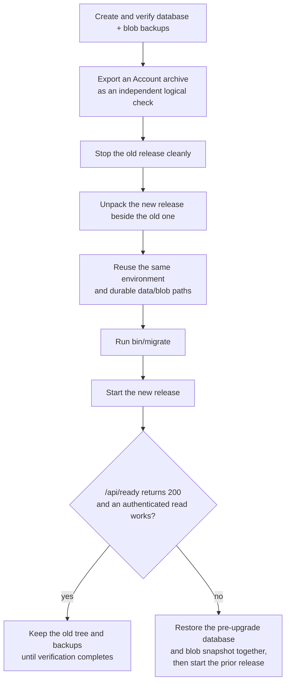

<!-- SPDX-License-Identifier: Cartulary-Sustainable-Use-1.0 -->

# Upgrades

## Standalone self-update

Downloaded pg0 releases can check and install official signed packages:

```bash
bin/update --check
bin/update --version 0.3.1
```

The updater verifies the detached manifest signature and selected archive
checksum, writes and validates a `cartulary-account-1` archive under the data
root, migrates the staged release, then switches the `current` release pointer.
It retains old executable trees. The archive is a logical recovery checkpoint,
not a rollback substitute: it omits credentials and derived data and imports
only into a fresh Account. Keep database and blob backups for rollback.

Set `CARTULARY_AUTO_UPDATE=minor` to permit release-marked stable patch/minor
updates before startup. Major versions, prereleases, and releases not marked
eligible remain notification-only. `/api/ready`, the Operations console, and
startup logs show the availability result and update command.

Migrations are forward-only. Roll back by restoring a snapshot, never by
running old code against a new schema.

## Procedure



1. Create and verify **both** the database and blob backups described in
   [Backup and restore](backup-restore.md).
2. Export the Account archive as an independent logical recovery check — see
   [Export and import](portability.md).
3. Stop the old release cleanly.
4. Unpack the new release **beside** the old one. Do not overwrite the old
   executable tree or the data directory.
5. Reuse the same environment and the same durable data and blob paths.
6. Run `bin/migrate`, then start the new release.
7. Require `GET /api/ready` to return 200, and exercise one authenticated read.
8. Retain the old executable and the pre-upgrade backups until verification
   completes.

## Rollback

Rollback is:

1. stop the new release;
2. restore the database **and** the blob snapshot from the same recovery point;
3. start the prior release.

!!! danger "Never run an old release against a newly migrated database"
    The schema will be ahead of the code. Restore both sides together.

## Migration timing

| Setting | Behaviour |
| --- | --- |
| `CARTULARY_AUTO_MIGRATE=true` | Migrations run as a supervised startup step before traffic is accepted. |
| `CARTULARY_AUTO_MIGRATE=false` | Run `bin/migrate` yourself before starting the release. |

Use `false` when migrations require separate approval.

## After the upgrade

Watch queue depths on `/api/ready`. A new version may enqueue projection or
index rebuilds; `/api/v1/context` reports `fast_fallback: true` until
projections warm up.

## Version alignment

A release is coherent only when `mix.exs`, the changelog entry, the git tag,
and the evaluation evidence all name the same version. The release-readiness
check enforces this and fails closed. The maintainer-facing procedure lives in
the repository under
[`specs/process/release-checklist.md`](https://github.com/cartularyhq/cartulary/blob/main/specs/process/release-checklist.md).
